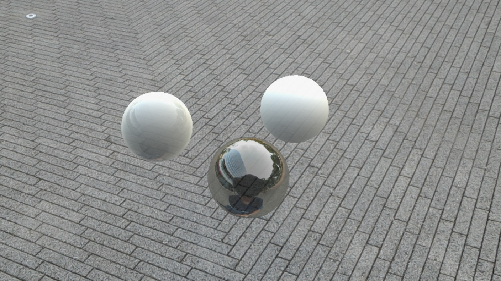
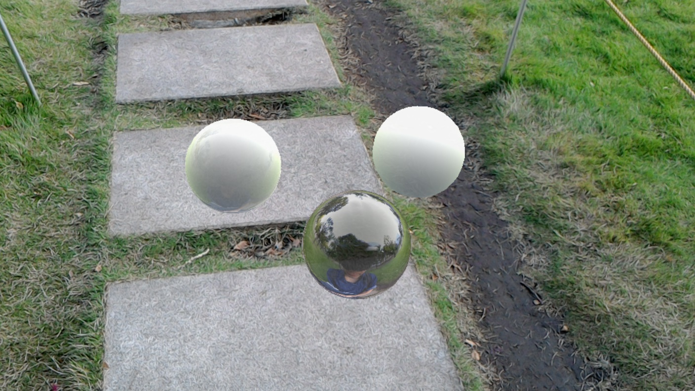
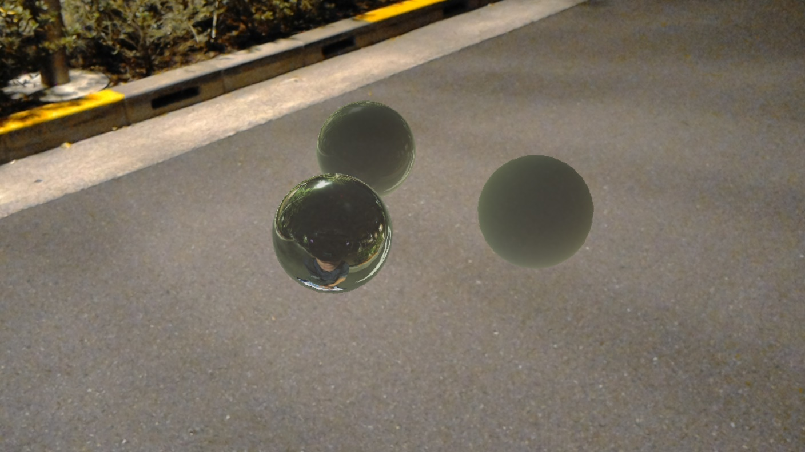

# Image-Based Lighting demo for HoloLens

# Tools
* Unity 5.6.3f1
* Visual Studio 2017

# Devices
* Microsoft HoloLens
* RICOH THETA S
* Raspberry Pi 3

# Softwares
* MJPG-streamer on Raspberry Pi 3

# Third party assets
## Marmoset Skyshop
* Image-Based Lighting Tools & Shaders
* https://www.assetstore.unity3d.com/jp/#!/content/8880

## Theta Shader Pack
* Unity 向けの THETA / THETA S の全天周画像をリアルタイムに Equirectanguler に変換するシェーダーと補助スクリプト一式
* http://stereoarts.jp/ThetaShaderPack_20150926.zip

## Sphere100.fbx
* 全天周画像用の天球モデル（法線内側向き）
* https://www.dropbox.com/s/u5b2uejauh38lvq/Sphere100.fbx
